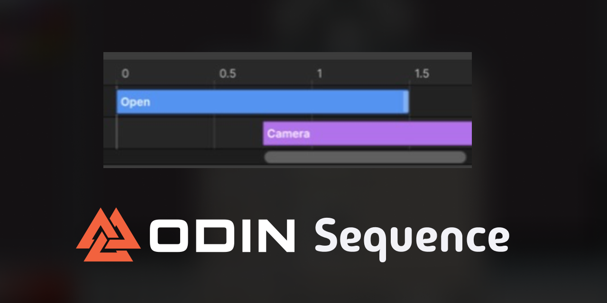
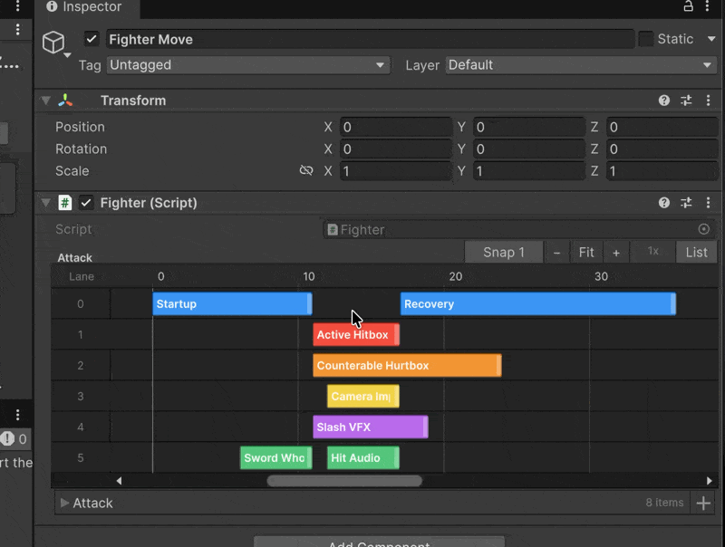

# Odin Sequence

Odin Sequence turns any `IList` of timed records into a compact editable
timeline in the Inspector. It is useful anywhere several systems need readable,
precise timing: short cinematics, fighting-game moves, hitbox and hurtbox
windows, combat abilities, animation phases, camera beats, VFX, and audio. It
works with existing data models, with no timeline base class, interface, or
custom editor window required.

## Requirements

- Unity 6000.4 or newer
- Odin Inspector 4.0 or newer

> [!WARNING]
> Odin Inspector is a separately licensed Asset Store product and is not included
> in this package.

The runtime, Editor, test, and sample assemblies are enabled only while Odin's
canonical `ODIN_INSPECTOR` symbol is active. Without Odin installed, this
package contributes no compiled assemblies to the project.

> [!NOTE]
> Odin Sequence authors timing data. Your project provides runtime playback and
> decides what each record does in its animation, combat, camera, VFX, or audio
> systems.

## Install

In Unity Package Manager, choose **Add package from git URL** and enter:

```text
https://github.com/martincalander/OdinSequence.git
```

Install and activate Odin Inspector to enable the sequence strip drawer.

## Usage



```csharp
using System;
using System.Collections.Generic;
using MartinCalander.OdinSequence;
using UnityEngine;

public sealed class Fighter : MonoBehaviour
{
    [SequenceStrip(
        nameof(FighterTimelineEvent.Start),
        nameof(FighterTimelineEvent.Duration),
        LaneMember = nameof(FighterTimelineEvent.Track),
        LabelMember = nameof(FighterTimelineEvent.Label),
        ColorMember = nameof(FighterTimelineEvent.Color),
        SnapInterval = 1d)]
    public List<FighterTimelineEvent> Attack = new List<FighterTimelineEvent>
    {
        new FighterTimelineEvent("Startup", 0, 11, FighterTrack.Animation, Color.cyan),
        new FighterTimelineEvent("Active Hitbox", 11, 6, FighterTrack.Hitbox, Color.red),
        new FighterTimelineEvent("Counterable Hurtbox", 11, 13, FighterTrack.Hurtbox, Color.blue),
        new FighterTimelineEvent("Camera Impact", 12, 5, FighterTrack.Camera, Color.yellow),
        new FighterTimelineEvent("Slash VFX", 11, 8, FighterTrack.Vfx, Color.magenta),
        new FighterTimelineEvent("Hit Audio", 12, 5, FighterTrack.Audio, Color.green),
        new FighterTimelineEvent("Recovery", 17, 19, FighterTrack.Animation, Color.cyan)
    };
}

[Serializable]
public sealed class FighterTimelineEvent
{
    public FighterTimelineEvent(string label, int start, int duration, int track, Color color)
    {
        Label = label;
        Start = start;
        Duration = duration;
        Track = track;
        Color = color;
    }

    public string Label;
    public int Start;
    public int Duration;
    public int Track;
    public Color Color = Color.white;
}

public static class FighterTrack
{
    public const int Animation = 0;
    public const int Hitbox = 1;
    public const int Hurtbox = 2;
    public const int Camera = 3;
    public const int Vfx = 4;
    public const int Audio = 5;
}
```

This example stores timing in frames, so every edit snaps to one whole frame.
The start and duration paths are required. Lane, label, and color paths are
optional. Paths are relative to each list element and may use dots, such as
`Timing.Start`.

## Interactions

- Click a block to select it.
- Drag a block to move it in time.
- Drag the right edge to resize it.
- Hold Control or Command while dragging to bypass snapping.
- Scroll over the strip or use the toolbar to zoom.
- Choose **Fit** to frame the complete sequence.
- Toggle **List** to show or hide Odin's normal list drawer.

Every timeline edit uses Odin's public property APIs, supports Unity undo, and
marks the serialization root dirty. Invalid paths and unsupported member types
are reported beside the strip while the normal list stays available.

## Supported members

| Role | Supported value |
| --- | --- |
| Start | Any built-in integral, floating-point, or decimal type |
| Duration | Any built-in integral, floating-point, or decimal type |
| Lane | Any supported numeric type, rounded to the nearest lane number |
| Label | String or any value with a useful invariant string conversion |
| Color | `Color` or `Color32` |

See [the documentation](Documentation~/index.md) and import the **Fighter Move
Sequence** sample from Package Manager for a complete example with startup,
active hitbox and hurtbox windows, recovery, camera, VFX, and audio timing.

## License

MIT. See [LICENSE.md](LICENSE.md).
